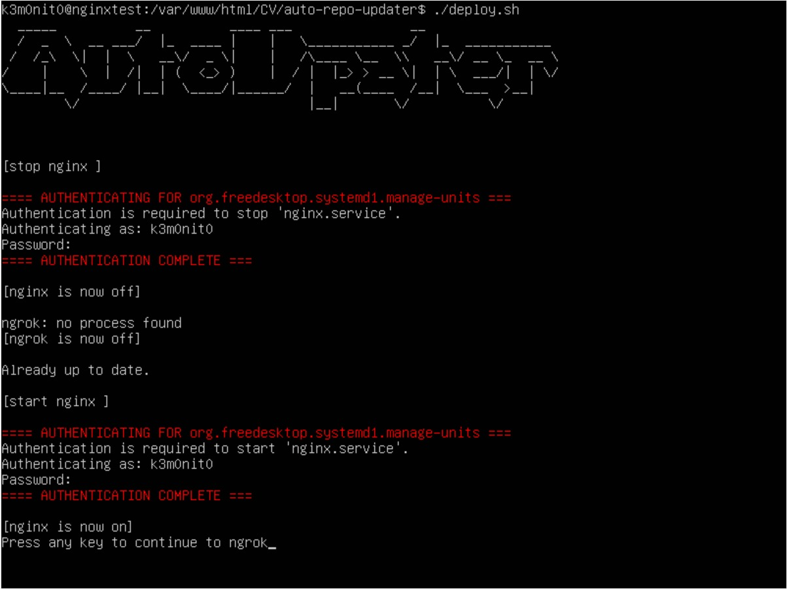

# auto-app-updater
A bash script that automates:

- stop ngrok and nginx services
- Clone a github repo
- Start ngrok and nginx services
- Open ngrok url in browser

### Install
>git clone https://github.com/JulianChan123/auto-repo-updater

>cd auto-repo-updater

>chmod +x deploy.sh

>./deploy.sh

> [!IMPORTANT]  
> You need to have installed ngrok and nginx

### Demo

